# 适应AI时代的Markdown渲染器：mdflow-cli

Markdown 转 HTML 命令行工具。支持兼容微信公众号富文本、普通HTML，配置参数丰富。

将 Markdown 转成带样式的 HTML 文件，或直接输出可用于微信公众号 `content` 的富文本内容。

仓库地址：[https://github.com/rongyan6/mdflow-cli](https://github.com/rongyan6/mdflow-cli)

如果这个项目对你有帮助，欢迎关注我的微信公众号：

<p align="center">
  
</p>

## 安装

### 命令行安装

```bash
npm i -g @rongyan/mdflow-cli
```

也可以直接用 `npx`：

```bash
npx @rongyan/mdflow-cli post.md
```

### 在程序中安装

```bash
npm i @rongyan/mdflow-cli
```

## 命令行使用

```bash
mdflow post.md
```

不传 `--output` 时，会默认生成到 Markdown 同目录、同名的 `.html` 文件。

例如：

```bash
mdflow post.md
```

会生成：

```bash
post.html
```

如果 `--output` 只传目录，则会自动使用 Markdown 文件名：

```bash
mdflow post.md --output dist/
```

会生成：

```bash
dist/post.html
```

如果要导出微信公众号富文本文件：

```bash
mdflow post.md --wxoutput
```

会生成：

```bash
post.wxhtml
```

如果要指定 Mermaid PNG 输出目录：

```bash
mdflow post.md --asset-dir ./assets
```

## 程序中使用

### 渲染完整 HTML

```js
import { readFile } from 'node:fs/promises'
import { renderMarkdown } from '@rongyan/mdflow-cli'

const markdown = await readFile('./post.md', 'utf8')

const result = await renderMarkdown(markdown, {
  theme: '优雅',
  primaryColor: '翡翠绿',
  codeLineNumbers: true,
  assetDir: './assets',
})

console.log(result.html)
```

### 渲染公众号富文本

```js
import { readFile } from 'node:fs/promises'
import { renderMarkdown } from '@rongyan/mdflow-cli'

const markdown = await readFile('./post.md', 'utf8')
const result = await renderMarkdown(markdown, {
  assetDir: './assets',
})

console.log(result.wxhtml)
```

返回结果里常用字段包括：

- `html`：完整 HTML 文档
- `wxhtml`：公众号 `content` 形态内容
- `contentHtml`：不带页面壳的正文 HTML
- `title`：自动解析出的标题
- `frontMatter`：Markdown front matter
- `readingTime`：字数、词数、预计阅读时间

说明：

- 程序化调用时，`html` 和 `wxhtml` 都是直接返回的，不会自动写文件
- 如果 Markdown 中包含 Mermaid，会默认自动转成 PNG
- 程序化调用时可以用 `assetDir` 指定 Mermaid PNG 的输出目录；未指定时默认输出到当前工作目录下的 `assets/`

## 效果示例

以下示例文件会随 npm 包一起发布，可直接本地运行：
`examples/minimal-showcase.md`

### 主题

<table>
  <tr>
    <td width="33.33%">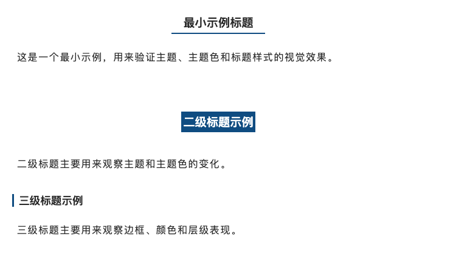</td>
    <td width="33.33%">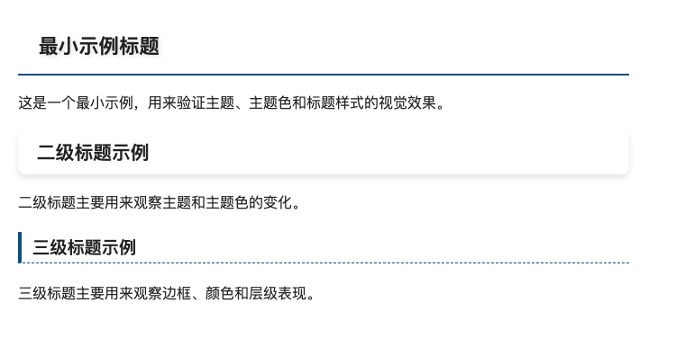</td>
    <td width="33.33%">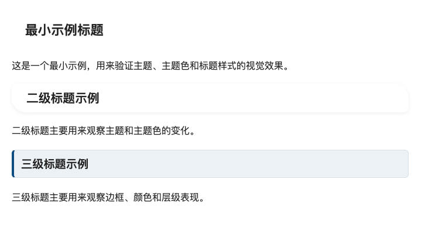</td>
  </tr>
  <tr>
    <td><code>--theme=经典</code></td>
    <td><code>--theme=优雅</code></td>
    <td><code>--theme=简洁</code></td>
  </tr>
</table>

### 主题色

以下截图固定使用 `--theme=经典`，主要观察标题颜色和边框色变化。

<table>
  <tr>
    <td width="33.33%"></td>
    <td width="33.33%">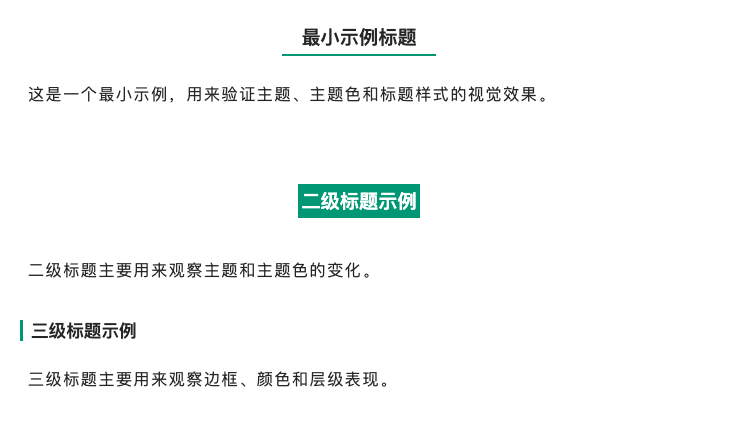</td>
    <td width="33.33%">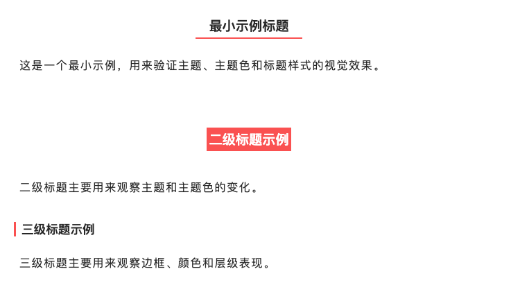</td>
  </tr>
  <tr>
    <td><code>--theme=经典 --primary-color=经典蓝</code></td>
    <td><code>--theme=经典 --primary-color=翡翠绿</code></td>
    <td><code>--theme=经典 --primary-color=活力橘</code></td>
  </tr>
</table>

<table>
  <tr>
    <td width="33.33%">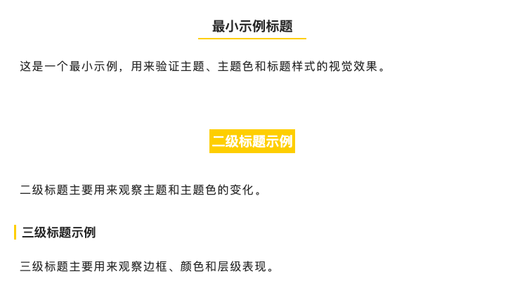</td>
    <td width="33.33%">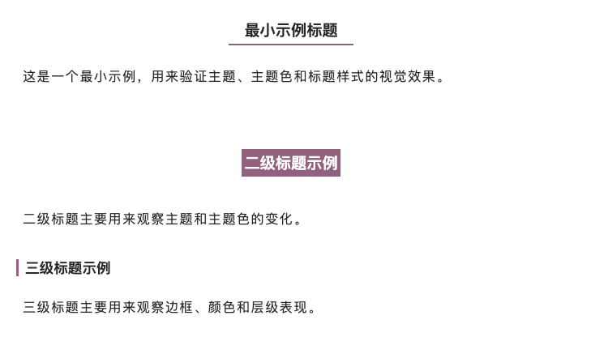</td>
    <td width="33.33%">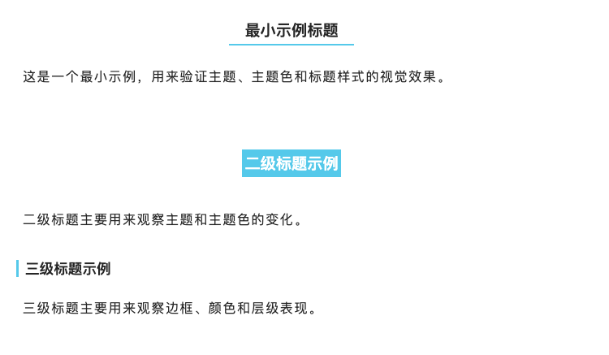</td>
  </tr>
  <tr>
    <td><code>--theme=经典 --primary-color=柠檬黄</code></td>
    <td><code>--theme=经典 --primary-color=薰衣紫</code></td>
    <td><code>--theme=经典 --primary-color=天空蓝</code></td>
  </tr>
</table>

<table>
  <tr>
    <td width="33.33%">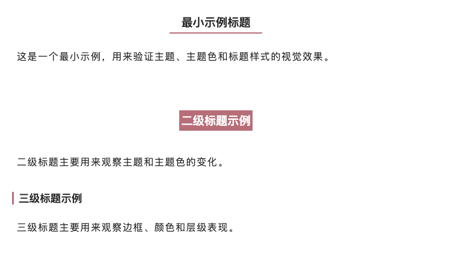</td>
    <td width="33.33%">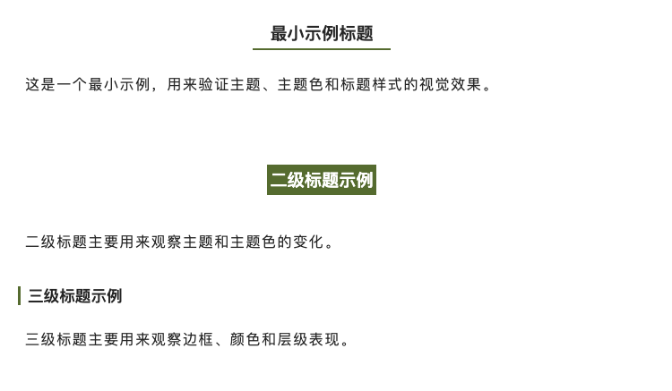</td>
    <td width="33.33%">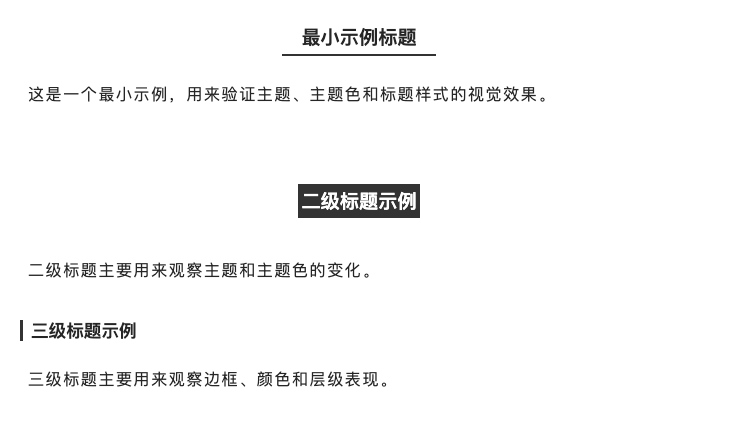</td>
  </tr>
  <tr>
    <td><code>--theme=经典 --primary-color=玫瑰金</code></td>
    <td><code>--theme=经典 --primary-color=橄榄绿</code></td>
    <td><code>--theme=经典 --primary-color=石墨黑</code></td>
  </tr>
</table>

<table>
  <tr>
    <td width="33.33%">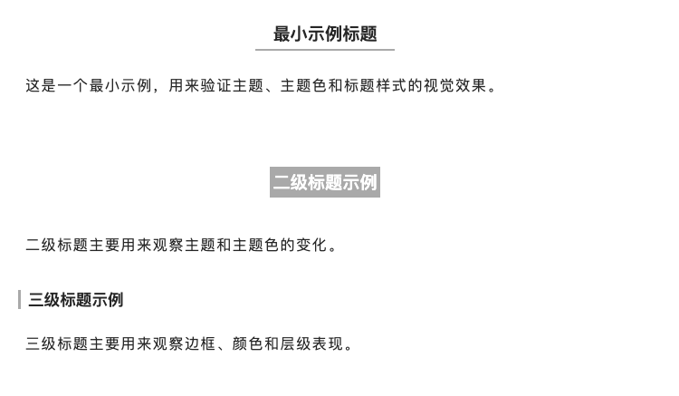</td>
    <td width="33.33%">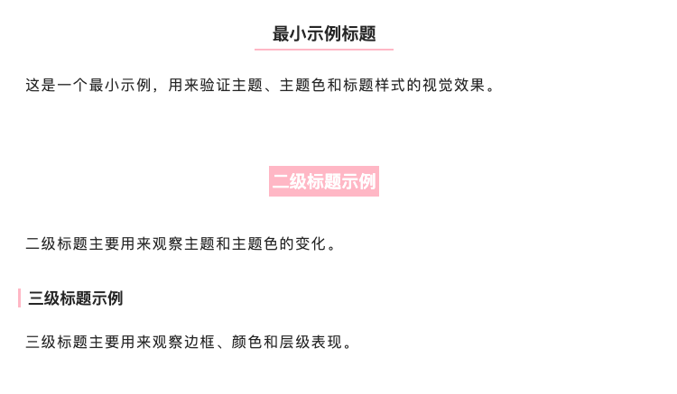</td>
    <td width="33.33%"></td>
  </tr>
  <tr>
    <td><code>--theme=经典 --primary-color=雾烟灰</code></td>
    <td><code>--theme=经典 --primary-color=樱花粉</code></td>
    <td></td>
  </tr>
</table>

### 标题样式

以下截图固定使用 `--theme=经典`，并让一级、二级、三级标题使用同一套样式，便于对比。

<table>
  <tr>
    <td width="33.33%"></td>
    <td width="33.33%">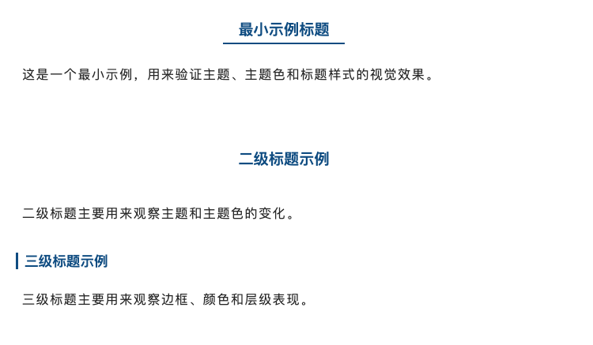</td>
    <td width="33.33%">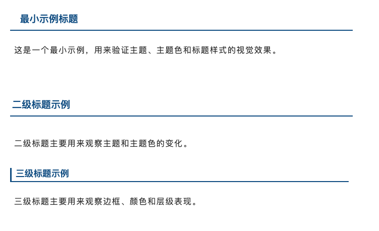</td>
  </tr>
  <tr>
    <td><code>--theme=经典 --heading-1=默认 --heading-2=默认 --heading-3=默认</code></td>
    <td><code>--theme=经典 --heading-1=主题色文字 --heading-2=主题色文字 --heading-3=主题色文字</code></td>
    <td><code>--theme=经典 --heading-1=下边框 --heading-2=下边框 --heading-3=下边框</code></td>
  </tr>
</table>

<table>
  <tr>
    <td width="33.33%">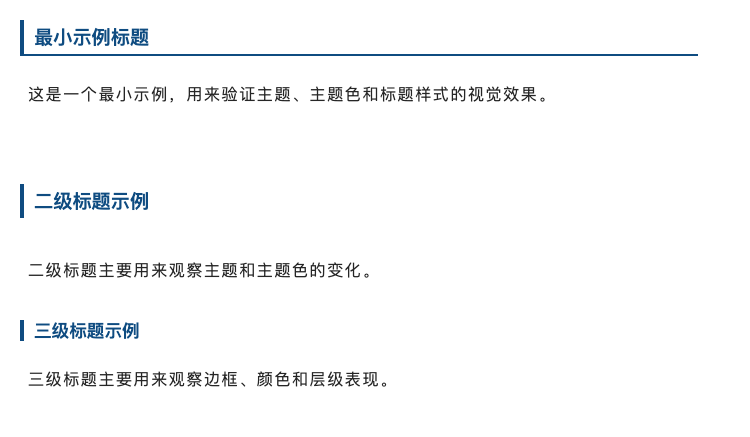</td>
    <td width="33.33%"></td>
    <td width="33.33%"></td>
  </tr>
  <tr>
    <td><code>--theme=经典 --heading-1=左边框 --heading-2=左边框 --heading-3=左边框</code></td>
    <td></td>
    <td></td>
  </tr>
</table>

## Mermaid 输出

如果 Markdown 中包含 ` ```mermaid ` 代码块，CLI 会自动调用官方 `@mermaid-js/mermaid-cli` 转成 PNG。

生成规则：

- HTML 文件：写到 `--output` 指定位置，或 Markdown 同级同名 `.html`
- Mermaid 图片：默认写到 Markdown 同级的 `assets/` 目录
- 也可以通过 `--asset-dir` 或程序中的 `assetDir` 指定输出目录
- CLI 导出的 HTML 中使用相对路径引用这些 PNG 文件
- 程序化调用返回的 HTML 中使用本地绝对路径；在 Windows 下会自动使用 `file:///` 形式

例如：

```bash
post.md
assets/mermaid-1-xxxxxx.png
post.html
```

## 参数

### 输入与输出

- `mdflow <input.md>`：必填，Markdown 文件路径
- `-o, --output=out.html`：输出 HTML 文件路径；可传文件名或目录
- `--wxoutput=post.wxhtml`：输出公众号 `content` 形态文件；可传文件名或目录
- `--asset-dir=./assets`：指定 Mermaid PNG 输出目录
- `-h, --help`：显示帮助

### 主题

- `--theme=经典|优雅|简洁`
- `--theme=default|grace|simple`
- 兼容别名：`classic`
- 默认值：`经典`，即 `default`

### 字体

- `--font-family=无衬线|衬线|等宽`
- `--font-family=sans|serif|mono|monospace`
- 兼容别名参数名：`--font`、`--fontFamily`
- 默认值：`无衬线`

对应关系：

- `无衬线` / `sans`
- `衬线` / `serif`
- `等宽` / `mono` / `monospace`

### 字号

- `--font-size=更小|稍小|推荐|稍大|更大`
- `--font-size=14px|15px|16px|17px|18px`
- 兼容别名参数名：`--size`、`--fontSize`
- 默认值：`推荐`，即 `16px`

对应关系：

- `更小` = `14px`
- `稍小` = `15px`
- `推荐` = `16px`
- `稍大` = `17px`
- `更大` = `18px`

### 主题色

- `--primary-color=经典蓝|翡翠绿|活力橘|柠檬黄|薰衣紫|天空蓝|玫瑰金|橄榄绿|石墨黑|雾烟灰|樱花粉`
- `--primary-color=blue|green|orange|yellow|purple|sky|rosegold|olive|black|gray|pink`
- `--custom-primary-color=#1677ff`
- 兼容别名参数名：
  `--color`、`--primaryColor`、`--customColor`、`--customPrimaryColor`
- 默认值：`经典蓝`

自定义颜色当前支持：

- `#RGB`
- `#RRGGBB`
- `rgb(...)`
- `rgba(...)`
- `hsl(...)`
- `hsla(...)`

### 标题样式

- `--heading-1=默认|主题色文字|下边框|左边框`
- `--heading-2=默认|主题色文字|下边框|左边框`
- `--heading-3=默认|主题色文字|下边框|左边框`
- 英文兼容值：
  `default|color-only|border-bottom|border-left`
- 额外兼容短别名：
  `color|bottom|left`
- 兼容别名参数名：
  `--heading1`、`--heading2`、`--heading3`
- 默认值：`h1/h2/h3` 都是 `默认`

### 代码块主题

- `--code-theme=github-dark`
- 也支持任意 highlight.js 主题名，比如：
  `github`、`github-dark`、`atom-one-dark`、`monokai`、`vs2015`
- 也支持直接传完整 CSS URL
- 兼容别名参数名：`--codeTheme`
- 默认值：`github-dark`

说明：

- 当传主题名时，会自动拼成
  `https://cdn-doocs.oss-cn-shenzhen.aliyuncs.com/npm/highlightjs/11.11.1/styles/<theme>.min.css`

### 图注格式

- `--legend=title 优先|alt 优先|只显示 title|只显示 alt|文件名|不显示`
- 英文兼容值：
  `title-alt|alt-title|title|alt|filename|none`
- 默认值：`只显示 alt`

### 布尔开关

以下参数都支持：

- 中文：`开启|关闭`、`开|关`
- 英文：`true|false`、`yes|no`、`on|off`
- 数字：`1|0`

支持的布尔参数：

- `--mac-code-block=开启|关闭`
  默认值：`开启`
- `--code-line-numbers=开启|关闭`
  兼容别名参数名：`--codeLineNumbers`
  默认值：`关闭`
- `--cite-status=开启|关闭`
  兼容别名参数名：`--cite`
  默认值：`关闭`
- `--use-indent=开启|关闭`
  兼容别名参数名：`--useIndent`
  默认值：`关闭`
- `--use-justify=开启|关闭`
  兼容别名参数名：`--useJustify`
  默认值：`关闭`

## 示例

```bash
mdflow post.md \
  --theme=优雅 \
  --font-family=衬线 \
  --font-size=稍大 \
  --primary-color=翡翠绿 \
  --heading-1=下边框 \
  --heading-2=主题色文字 \
  --heading-3=左边框 \
  --code-theme=github-dark \
  --legend=文件名 \
  --mac-code-block=开启 \
  --code-line-numbers=开启 \
  --cite-status=开启 \
  --use-indent=开启 \
  --use-justify=开启 \
  --output=post.html
```

```bash
mdflow post.md --wxoutput
```
